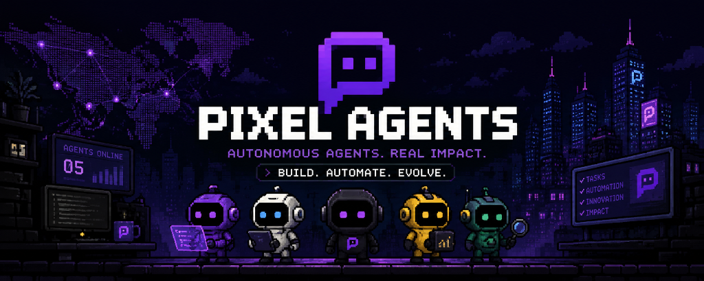

<p align="center">
  
</p>

<h1 align="center">PixelCrew</h1>

<p align="center">
  <strong>Autonomous Multi-Agent Engineering Swarm and Software Synthesis Framework</strong>
</p>

<p align="center">
  <a href="https://github.com/hiroqt/PixelCrew"></a>
  <a href="LICENSE"></a>
  <a href="https://nodejs.org"></a>
  <a href="#zero-runtime-dependencies"></a>
</p>

<p align="center">
  <a href="#overview">Overview</a> •
  <a href="#quickstart">Quickstart</a> •
  <a href="#floor-42-slash-commands-suite">Slash Commands</a> •
  <a href="#cross-ide-integration-architecture">IDE Integration</a> •
  <a href="#agent-roster-and-state-machine">Agent Roster</a> •
  <a href="#architecture">Architecture</a> •
  <a href="#visual-dashboard">Dashboard</a> •
  <a href="#anti-ai-design-guardian">Design Guardian</a> •
  <a href="#cli-reference">CLI Reference</a> •
  <a href="#testing">Testing</a> •
  <a href="#roadmap">Roadmap</a> •
  <a href="CONTRIBUTING.md">Contributing</a>
</p>

---

<a id="overview"></a>

## Overview

Modern AI coding assistants frequently operate as black boxes, concealing agent cognition behind non-descriptive status indicators or emitting unstructured terminal log dumps. Developers are left unable to observe what specific tasks an agent is executing, where dependencies are stalled, or how individual architectural decisions were reached.

PixelCrew resolves this observability and coordination challenge by structuring development into a coordinated, observable multi-agent engineering swarm. The workspace is modeled as a retro-themed virtual technology office on Floor 42 of Pixel Corps HQ, where specialized agent personas collaborate across design direction, frontend construction, backend engineering, data modeling, performance analysis, security verification, and quality assurance.

### Architectural Comparison

| Capability | PixelCrew | Conventional AI Tools |
|:---|:---|:---|
| **Observability** | Real-time 2D canvas with per-agent state machines, live event stream, and audio telemetry | Static spinner animations or raw JSON log dumps |
| **Runtime Footprint** | Zero npm dependencies; built entirely on Node.js standard library | Heavy dependency trees and required container runtimes |
| **IDE Interoperability** | Native slash command and skill generation across Claude Code, Cursor, Kiro, and Antigravity | Single-environment lock-in |
| **Codebase Awareness** | Automated static profiling for frameworks (Next.js, React), ORMs (Prisma, Drizzle), and testing suites | Generic prompt wrappers lacking repository context |
| **Design Integrity** | Six-dimension anti-AI quality gate enforcing fluid typography and asymmetric layouts | Repetitive card grids and generic purple gradient templates |
| **Task Scheduling** | Directed Acyclic Graph (DAG) planner resolving dependency barriers with parallel dispatch | Monolithic single-thread code generation |

---

<a id="quickstart"></a>

## Quickstart

### Prerequisites

- Node.js >= 18.0.0
- npm >= 9.0.0
- Zero external runtime packages required

### 1. Initialize a Project Workspace

Run initialization directly via `npx` in any project directory or greenfield workspace:

```bash
# Preview proposed files and directories without writing to disk
npx pixelcrew init --dry-run

# Automatically configure the workspace for all detected and available AI IDEs
npx pixelcrew init --yes

# Initialize exclusively for a specific environment
npx pixelcrew init --provider claude-code
```

During initialization, PixelCrew performs an architectural scan of your repository, establishes `.pixel-crew/` configuration, generates agent personas adapted to your stack, and creates IDE-native slash command definitions.

### 2. Configure Cross-Device Global Slash Commands

To make PixelCrew slash commands available globally across all projects on your machine:

```bash
# Distribute command files and skills to global user directories (~/.claude, ~/.cursor, ~/.gemini, ~/.kiro)
npx pixelcrew install --global

# Verify installation health across all providers
npx pixelcrew doctor
```

### 3. Launch the Orchestration Server and Visual Dashboard

```bash
# Launch local daemon on default port 4747 and open the browser dashboard
npx pixelcrew start

# Run headless or bind to a custom port
npx pixelcrew start --port 8080 --no-open
```

### 4. Execute Multi-Agent Synthesis

Generate an application or execute a structured sprint:

```bash
# Run full multi-agent synthesis pipeline from natural language specification
npx pixelcrew assemble "Build a modern analytics dashboard with dark theme and API routes"

# Generate section topology and task DAG without writing code
npx pixelcrew blueprint "High-throughput customer billing platform"

# View token-optimized git activity changelog
npx pixelcrew recap
```

---

<a id="floor-42-slash-commands-suite"></a>

## Floor 42 Slash Commands Suite

PixelCrew provides 24 specialized slash commands that can be typed directly into your AI IDE chat interface (Claude Code CLI, Cursor Chat, Kiro AI, Google Antigravity) or invoked from your terminal via `npx pixelcrew <command>`.

To browse the interactive command menu at any time:
```bash
# Display the complete command catalog in your terminal
npx pixelcrew /
npx pixelcrew commands
```

### Creation and Architecture

| Command | Aliases | Description |
|:---|:---|:---|
| `/assemble` | `/fullstack`, `/build-app`, `/make-app` | Dispatches the complete 16-step multi-agent sprint pipeline from brand direction to full-stack code synthesis. |
| `/blueprint` | `/plan-app`, `/architecture`, `/spec` | Generates section topology, schema definitions, and task dependency DAG without generating code. |
| `/oneshot` | `/make`, `/generate` | Rapid single-prompt website and component synthesis with creative direction constraints. |
| `/manifest` | `/agents`, `/crew-status` | Displays active agent personas, assigned skills, and file system permission boundaries. |
| `/retrofit` | `/modernize`, `/upgrade` | Inspects legacy component code, extracts inline styles into design tokens, and restructures layouts. |
| `/init` | `/setup`, `/bootstrap` | Scans workspace dependencies, generates `.pixel-crew/` configuration, and adapts agent prompts. |

### Retro Aesthetic and Anti-AI Direction

| Command | Aliases | Description |
|:---|:---|:---|
| `/render` | `/art-direction`, `/visual-style` | Applies bespoke typography pairings, high-contrast surface tiers, and distinctive brand aesthetics. |
| `/8bit` | `/pixel-art`, `/retro` | Injects retro 8-bit styling, pixelated border treatments, and arcade monospace typography. |
| `/chromatic` | `/cyberpunk`, `/neon` | Applies high-contrast cyberpunk color schemes, duotone accents, and darkroom styling. |
| `/bento` | `/grid`, `/cards` | Reorganizes uniform content sections into dynamic, asymmetrical Bento grid arrangements. |
| `/de-slop` | `/anti-ai`, `/clean` | Scans and strips generic AI design tropes (purple gradient blobs, uniform 3-card layouts, cliché copywriting). |
| `/typeset` | `/typography`, `/fonts` | Applies mathematical fluid typography using CSS `clamp()` scales from body text to display headings. |
| `/polish` | `/refine`, `/tune` | Inspects micro-interactions, hover states, transitions, and accessibility contrast compliance. |
| `/animate` | `/motion`, `/transitions` | Introduces purposeful CSS micro-animations and entrance reveals while respecting reduced motion preferences. |
| `/bolder` | `/high-contrast`, `/loud` | Increases contrast ratios, heading weight, border definitions, and visual punch. |
| `/quieter` | `/minimal`, `/subtle` | Softens borders, reduces accent saturation, and expands whitespace for minimal editorial presentations. |

### Production Hardening and SRE

| Command | Aliases | Description |
|:---|:---|:---|
| `/sentinel` | `/security`, `/harden` | Runs automated security checks covering OWASP Top 10 vulnerabilities, authentication posture, and security headers. |
| `/boss-fight` | `/debug-swarm`, `/swarm-fix` | Deploys specialized agents to isolate and resolve complex multi-file bugs and build failures. |
| `/warp` | `/performance`, `/speed` | Profiles Core Web Vitals (LCP, INP, CLS), bundle dimensions, and server-side streaming efficiency. |
| `/calibrate` | `/benchmark`, `/eval` | Evaluates synthesized code against quality thresholds for accessibility, performance, and type safety. |
| `/audit` | `/inspect`, `/health` | Conducts holistic architecture, dependency, and security audits across the codebase. |
| `/overdrive` | `/stress-test`, `/load` | Analyzes endpoint resilience, connection pooling, and rate-limiting behaviors under load. |

### Floor 42 Operations and Session Management

| Command | Aliases | Description |
|:---|:---|:---|
| `/recap` | `/summary`, `/changelog`, `/whatdone` | Generates a compact, token-optimized git activity changelog and session summary without prompt overhead. |
| `/office` | `/dashboard`, `/hq` | Displays real-time Floor 42 workstation telemetry, agent occupancy, and background daemon status. |
| `/roster` | `/team`, `/who` | Lists agent specialization matrices, active assignments, and runtime capabilities. |
| `/onboard` | `/quickstart`, `/tour` | Interactive walkthrough introducing multi-agent workflows and command shortcuts. |
| `/distill` | `/compact`, `/shrink` | Prunes redundant multi-turn chat context to preserve prompt token limits. |
| `/commands` | `/slash-commands`, `/help`, `/menu` | Displays the complete Floor 42 command catalog, syntax rules, and IDE integration details. |

---

<a id="cross-ide-integration-architecture"></a>

## Cross-IDE Integration Architecture

PixelCrew is designed to eliminate provider lock-in. When commands or skills are installed, PixelCrew translates them into the native discovery format expected by each target editor.

```text
                                  ┌─────────────────────────────┐
                                  │      PIXEL CREW CORE        │
                                  │   FLOOR 42 COMMAND SUITE    │
                                  └──────────────┬──────────────┘
                                                 │
            ┌─────────────────────┬──────────────┴──────────────┬─────────────────────┐
            │                     │                             │                     │
            ▼                     ▼                             ▼                     ▼
┌───────────────────────┐ ┌───────────────────────┐ ┌───────────────────────┐ ┌───────────────────────┐
│     CLAUDE CODE       │ │      CURSOR IDE       │ │        KIRO AI        │ │   GOOGLE ANTIGRAVITY  │
│                       │ │                       │ │                       │ │                       │
│ • .claude/commands/   │ │ • .cursor/commands/   │ │ • .kiro/workflows/    │ │ • AGENTS.md           │
│   *.md (with YAML &   │ │   *.md                │ │   *.md                │ │ • GEMINI.md           │
│   $ARGUMENTS)         │ │ • .cursor/rules/      │ │ • .kiro/prompts/      │ │ • .agents/rules/      │
│ • CLAUDE.md           │ │   pixelcrew.mdc       │ │   *.md                │ │   pixelcrew.md        │
│ • .claude-plugin/     │ │ • .cursorrules        │ │ • .kirorules          │ │ • .agents/skills/     │
└───────────────────────┘ └───────────────────────┘ └───────────────────────┘ └───────────────────────┘
```

### Editor Discovery Formats

1. **Anthropic Claude Code**
   - Individual slash commands are written to `.claude/commands/<command>.md` (workspace) and `~/.claude/commands/<command>.md` (global).
   - Each command file includes YAML frontmatter describing its behavior and embeds `$ARGUMENTS` to capture user input passed after the slash command.
   - Comprehensive workspace instructions are placed in `CLAUDE.md`.

2. **Cursor IDE**
   - Command specifications are generated under `.cursor/commands/<command>.md`.
   - Structural coding rules and anti-AI-slop constraints are established in `.cursor/rules/pixelcrew.mdc` and `.cursorrules`.

3. **Kiro AI**
   - Prompts are generated in `.kiro/prompts/<command>.md` and registered as workflows in `.kiro/workflows/<command>.md`.
   - Operational boundaries and rules are configured in `.kirorules` and `.kiro/rules/pixelcrew.md`.

4. **Google Antigravity and Universal Coding Agents**
   - Instructions and persona roles are generated in `AGENTS.md` and `GEMINI.md`.
   - Global and workspace rules are maintained in `.agents/rules/pixelcrew.md`.
   - Standardized capabilities are distributed to `.agents/skills/<skill>/SKILL.md`.

### Clean Greenfield Installation Behavior

When running `pixelcrew init --yes` on a new computer or clean environment:
- If an ambient IDE is detected via environment variables (e.g., `CLAUDE_CODE`, `CURSOR_VERSION`, `KIRO`), PixelCrew targets that environment.
- If existing workspace markers are detected, those specific editor configurations are generated.
- If global IDE directories exist in the user home directory (`~/.claude`, `~/.cursor`, `~/.kiro`, `~/.gemini`), PixelCrew configures files for all detected editors.
- If no specific IDE is present and `--yes` is used without an explicit `--provider` flag, PixelCrew defaults to generating universal support across all environments. If the user passes `--provider none`, clean CLI mode is used without external IDE files.

---

<a id="agent-roster-and-state-machine"></a>

## Agent Roster and State Machine

PixelCrew provisions 7 specialized agents with distinct domain boundaries, filesystem permissions, and operational responsibilities:

| Agent Persona | Color Tag | Specialization | Core Responsibilities |
|:---|:---|:---|:---|
| **Orchestrator** | Purple | Lead Systems Architect | Analyzes user requests, constructs DAG dependency graphs, coordinates sprint checkpoints, and validates architectural compliance. |
| **Frontend Engineer** | Cyan | UI/UX & Interactivity | Synthesizes responsive React and Next.js App Router components, fluid typography, CSS architecture, and accessible micro-interactions. |
| **Backend Engineer** | Magenta | APIs & Business Logic | Builds route handlers, server actions, data schemas, authentication middleware, validation layers, and external service adapters. |
| **Database Architect** | Gold | Data Layer & Persistence | Designs relational database schemas, migrations, ORM entity definitions (Prisma, Drizzle), and indexing strategies. |
| **Security Sentinel** | Red | Security & Audit | Evaluates authorization flows, CSRF protection, input sanitation, dependency vulnerabilities, and security header configurations. |
| **Performance SRE** | Green | Optimization & Core Web Vitals | Inspects Largest Contentful Paint (LCP), Interaction to Next Paint (INP), Cumulative Layout Shift (CLS), code splitting, and caching. |
| **QA Automation** | Purple | Verification & Testing | Generates automated test suites (unit, integration, end-to-end), validates regression resistance, and audits accessibility compliance. |

### Deterministic Lifecycle States

```text
[IDLE]
  │
  ├─► User submits task or slash command
  │
[ANALYZING]
  │   • Reads codebase context and project manifest
  │   • Evaluates file boundaries and dependencies
  │
[WORKING]
  │   • Generates code, configuration, or documentation
  │   • Emits live telemetry events to events.jsonl and dashboard
  │
[VERIFYING]
  │   • Runs automated tests, syntax linting, and quality scoring
  │   • Validates anti-slop rubric thresholds
  │
[COMPLETED]
      • Emits task completion event
      • Returns agent workstation to idle state
```

---

<a id="architecture"></a>

## Architecture

PixelCrew is implemented with a strictly modular architecture containing zero third-party runtime dependencies. All functionality relies directly on Node.js standard library APIs (`node:http`, `node:events`, `node:fs/promises`, `node:path`, `node:child_process`, `node:crypto`).

```text
┌────────────────────────────────────────────────────────────────────────┐
│                        DEVELOPER WORKSPACE                             │
│       CLI: npx pixelcrew <cmd>  │  IDE: /assemble, /blueprint, etc.   │
└───────────────────────────────────┬────────────────────────────────────┘
                                    │
                                    ▼
┌────────────────────────────────────────────────────────────────────────┐
│                      ORCHESTRATION DAEMON                              │
│                                                                        │
│   ┌───────────────────┐  ┌───────────────────┐  ┌──────────────────┐  │
│   │ Codebase Profiler │  │ DAG Task Graph    │  │ Parallel         │  │
│   │                   │  │                   │  │ Concurrency      │  │
│   │ Detects runtime,  │  │ Decomposes tasks, │  │ Limiter          │  │
│   │ frameworks, ORMs, │  │ resolves barriers,│  │ Dispatches tasks │  │
│   │ and test runners  │  │ prevents cycles   │  │ across slots     │  │
│   └─────────┬─────────┘  └─────────┬─────────┘  └─────────┬────────┘  │
│             └──────────────────────┼──────────────────────┘           │
└───────────────────────────────────┬────────────────────────────────────┘
                                    │
                  ┌─────────────────┴─────────────────┐
                  ▼                                   ▼
┌───────────────────────────────────┐   ┌────────────────────────────────┐
│          EVENT PIPELINE           │   │       MULTI-AGENT SWARM        │
│                                   │   │                                │
│ • Append-only events.jsonl        │   │ • 7 Persona State Machines     │
│ • Server-Sent Events (SSE) stream │◄──┤ • Filesystem Permission Gates  │
│ • REST Dispatch (/api/emit)       │   │ • Floor 42 Workstation Sprites │
│ • Token Telemetry Collector       │   │ • Context Pruning Engine       │
└─────────────────┬─────────────────┘   └────────────────────────────────┘
                  │
                  ▼
┌───────────────────────────────────┐
│     PIXEL CORPS HQ DASHBOARD      │
│                                   │
│ • 960x420 HTML5 Double-Buffered   │
│ • Web Audio API Synthesizer       │
│ • Live #engineering-feed Stream   │
│ • Token Usage & Cost Scorecard    │
└───────────────────────────────────┘
```

### Zero Runtime Dependencies

PixelCrew enforces a strict zero-dependency policy for runtime code:

| Capability | Standard Library Module | Implementation Role |
|:---|:---|:---|
| Web Server & SSE | `node:http` | Serves dashboard assets, REST API, and Server-Sent Events stream |
| Filesystem I/O | `node:fs/promises`, `node:fs` | Atomic read/write operations, directory trees, and events logging |
| Event Bus | `node:events` | Internal decoupled pub/sub message pipeline |
| Path Resolution | `node:path`, `node:url` | Cross-platform file path normalization |
| Process Execution | `node:child_process` | Git execution and toolchain diagnostic execution |
| Cryptography | `node:crypto` | Session IDs, task hashes, and unique event identifiers |
| System Diagnostics | `node:os` | CPU profiling, user home path resolution, platform detection |
| Test Harness | `node:test`, `node:assert` | Comprehensive automated unit, integration, and E2E test suites |

---

<a id="visual-dashboard"></a>

## Visual Dashboard — Floor 42

The PixelCrew dashboard renders an interactive 2D pixel-art startup office running at 60 FPS using an HTML5 Canvas with hardware-accelerated double buffering.

### Key Capabilities

- **Workstation Matrix**: 8 dedicated office pods representing each agent's active desk, computer monitors, and status beacons.
- **Procedural Character Sprites**: Distinct pixel characters that visually transition between idle breathing, active typing, test verification, and completion states.
- **Engineering Activity Stream**: A live Slack-style activity log (`#engineering-feed`) displaying real-time events, modified file paths, and build statuses.
- **Synthesized 8-Bit Audio Engine**: Procedural chiptune sound effects generated directly via the Web Audio API without external audio files.
- **Token Telemetry Monitor**: Visual tracking of input/output token volume, estimated cost savings, and context pruning efficiency.
- **Keyboard Shortcuts**:
  - `[O]` Open OneShot Studio
  - `[R]` View Audit & Security Reports
  - `[1-7]` Inspect individual agent status and skill cards
  - `[SPACE]` Run interactive multi-agent demonstration sprint
  - `[ESC]` Dismiss modal overlays

---

<a id="anti-ai-design-guardian"></a>

## Anti-AI Design Guardian

To ensure synthesized user interfaces maintain genuine production quality and avoid generic AI design patterns, PixelCrew includes an automated Anti-AI Quality Gate. Generated pages are evaluated across a six-dimension scoring rubric:

```text
Final Score = (Originality + Typography + Layout + Visual Hierarchy + Brand Consistency + (10 - Generic AI Penalty)) / 6
```

**Passing Threshold**: >= 8.5 / 10.0

### Explicitly Blocked Design Patterns

- Repetitive, blurred cyan-and-purple gradient blobs placed on flat black surfaces.
- Uniform, symmetrical 3-card repeating grids with identical dimensions.
- Generic marketing copy (*"Unlock the power of AI"*, *"Seamlessly elevate your workflow"*).
- Nested card-in-card containers with redundant padding and border clutter.
- Reliance on default system fonts without curated typographic scales.
- Decorative, non-functional pill badges placed above headings.

### Curated Design Archetypes

| Archetype | Display Font | Body Font | Color Strategy | Spatial Layout |
|:---|:---|:---|:---|:---|
| **Editorial Asymmetric** | *Instrument Serif* | *Plus Jakarta Sans* | Off-black, Warm Cream, Amber accent | 7:5 asymmetric columns, overlapping boundaries |
| **Technical Lab** | *Space Grotesk* | *JetBrains Mono* | Deep Obsidian, Steel, Emerald signal | Monospaced metrics, terminal containers |
| **Kinetic Studio** | *Syne* | *DM Sans* | Pure Void, High-contrast Stark White, Electric Cyan | High-impact scale contrast, Bento matrices |

---

<a id="cli-reference"></a>

## CLI Reference

```bash
npx pixelcrew <command> [arguments] [flags]
```

### Primary Commands

| Command | Arguments | Description |
|:---|:---|:---|
| `init` | `[targetDir]` | Analyzes codebase and bootstraps `.pixel-crew/` configuration. |
| `start` | | Launches orchestration daemon and opens the visual dashboard. |
| `assemble` | `"<prompt>"` | Executes end-to-end software synthesis pipeline. |
| `blueprint` | `"<prompt>"` | Generates architecture specifications and dependency DAGs without generating code. |
| `oneshot` | `"<prompt>"` | Rapid application synthesis using tailored creative direction. |
| `recap` | `[commitCount]` | Summarizes recent git activity into a token-optimized changelog. |
| `doctor` | | Runs system diagnostic checks across Node.js, Git, and installed AI IDEs. |
| `status` | | Outputs running agent statuses, active tasks, and server health. |
| `install` | | Distributes agent skills to workspace or global IDE directories. |
| `add` | `<skillId>` | Adds a specific skill to designated provider directories. |
| `sync` | | Synchronizes installed skills across all active IDE environments. |
| `commands` | `[category]` | Displays the Floor 42 command catalog and syntax guide. |
| `stop` | | Gracefully terminates background orchestration server. |

### Configuration Flags

| Flag | Type | Default | Description |
|:---|:---|:---|:---|
| `--dry-run` | Boolean | `false` | Previews planned file operations without writing to disk. |
| `--yes`, `-y` | Boolean | `false` | Bypasses interactive confirmation prompts. |
| `--provider <name>` | String | `all` | Specifies target provider (`claude-code`, `cursor`, `kiro`, `antigravity`, `all`, `none`). |
| `--global` | Boolean | `false` | Targets user-level configuration directories instead of current repository. |
| `--target <tech>` | String | `nextjs` | Sets target generation framework (`nextjs`, `vanilla`). |
| `--port <number>` | Number | `4747` | Port for local orchestration server and dashboard. |
| `--no-open` | Boolean | `false` | Suppresses automatic browser launch when running `start`. |
| `--out <directory>` | String | `.` | Destination path for synthesized application code. |

---

<a id="testing"></a>

## Testing

PixelCrew includes an automated test suite implemented directly on Node.js native `node:test` and `node:assert` modules.

```bash
# Run the automated test suite
node --test tests/commands-discovery.e2e.test.js tests/commands.test.js tests/installer.test.js tests/init-multi-ide.test.js tests/sync-providers.test.js
```

### Verified Test Areas

- **End-to-End Slash Command Discovery**: Validates slash command generation on clean devices across Claude Code, Cursor, Kiro, Antigravity, and CLI.
- **Provider Synchronization**: Verifies that skills, workflows, and prompts remain identical across all target IDE directories.
- **Dry-Run Integrity**: Confirms that operations executed with `--dry-run` perform zero file system writes.
- **DAG Execution & Concurrency**: Validates dependency resolution, cycle prevention, and parallel execution in the task scheduler.
- **Git Recap Engine**: Ensures git changelogs are extracted accurately, windowed properly, and formatted cleanly without token waste.

---

<a id="roadmap"></a>

## Roadmap

| Milestone | Target Scope | Current Status |
|:---|:---|:---|
| **v0.1** | Core CLI, codebase profiler, Floor 42 canvas, SSE telemetry pipeline, 8-bit audio synth | [Completed] |
| **v0.2** | 24 Floor 42 slash commands, cross-IDE command discovery, Anti-AI quality gate, git recap engine | [Completed] |
| **v0.3** | Automated Git worktree isolation, three-way merge conflict resolver, multi-branch swarming | [In Progress] |
| **v0.4** | External model provider runtime adapters (Gemini API, Claude API, OpenAI API, Ollama) | [Planned] |
| **v0.5** | Multi-floor office expansions, distributed peer-to-peer swarms via WebSockets and WebRTC | [Planned] |

---

<a id="documentation-and-contributing"></a>

## Documentation and Contributing

| Resource | Scope |
|:---|:---|
| [PRODUCT.md](PRODUCT.md) | Product strategy, persona definitions, and feature release milestones |
| [DESIGN.md](DESIGN.md) | Design specifications, color systems, canvas engine, and typography standards |
| [TESTING.md](TESTING.md) | Testing conventions, fixture runner documentation, and CI workflows |
| [CONTRIBUTING.md](CONTRIBUTING.md) | Contribution standards, code style guides, and pull request checklist |
| [LICENSE](LICENSE) | Apache License, Version 2.0 |

Contributions are welcome. Please read [CONTRIBUTING.md](CONTRIBUTING.md) for guidelines on code formatting and test verification before submitting changes.

---

<p align="center">
  <sub>Built with care and zero runtime dependencies by <a href="https://github.com/hiroqt">@hiroqt</a></sub>
</p>
