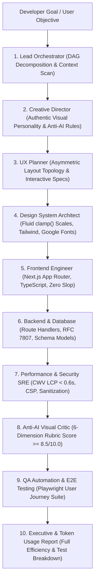

# PixelCrew (`@hiroqt/pixelcrew`)

<p align="center">
  <strong>Autonomous Multi-Agent Engineering Swarm & Retro Pixel-Art Startup Office</strong><br>
  <em>Transform any codebase into an observable, choreographed AI engineering workspace with design-first synthesis and automated E2E testing.</em>
</p>

<p align="center">
  <a href="LICENSE"></a>
  <a href="https://nodejs.org"></a>
  <a href="package.json"></a>
  <a href="https://github.com/hiroqt/PixelCrew"></a>
  <a href="CONTRIBUTING.md"></a>
</p>

---

## 🏢 The Background & Origin of PixelCrew

### The Observability Crisis in AI Engineering
As software development rapidly shifts toward autonomous multi-agent AI swarms—where specialized agents simultaneously refactor frontends, write database migrations, patch APIs, and run regression test suites—developers face a major problem: **the black-box opacity crisis**.

Traditional AI coding tools provide either:
1. **Opaque Spinners**: Hiding all subagent thought processes behind a single generic "Thinking..." indicator.
2. **Terminal Log Flood**: Dumping thousands of raw console lines and unformatted JSON envelopes, making it impossible to track dependencies, bottlenecks, or breaking changes in real time.

### The Philosophy: Observable, Design-First, and End-to-End Grounded
**PixelCrew was created to turn the invisible execution loop into an observable, choreographed engineering office.**

Modeled after **Floor 42 of Pixel Corps HQ**, PixelCrew pairs developers with an autonomous squad of specialized engineering personas:
- Every subagent has a dedicated physical workstation with real-time sprite state changes, mechanical keyboard typing animations, and glowing monitor telemetry.
- CRT phosphor scanlines, daytime/night-mode cyberpunk office lighting, and procedural 8-bit Web Audio chiptunes bring engineering progress to life.
- **Zero AI Slop**: Enforces strict creative direction, fluid `clamp()` typography scales, and asymmetric layout rules *before* writing code, completely eliminating purple mesh gradient blobs and cliché copy.
- **Full-Stack Grounding**: Takes every objective all the way through design, multi-file code generation, type-safe API route contracts, schema models, performance SRE profiling, and **automated Playwright / Vitest E2E user journey testing**, culminating in a comprehensive post-execution Token Optimization report.

---

## ⚡ 10-Second Quickstart

No global installations or complex configuration required. Run directly in your project:

```bash
# 1. Launch the orchestrator daemon and real-time visual office dashboard
npx pixelcrew start

# 2. Dispatch a full-stack goal (from design to automated E2E testing)
npx pixelcrew task "Build a modern portfolio for an AI engineer with Next.js and E2E tests"

# 3. Initialize and adapt PixelCrew to an existing codebase
npx pixelcrew init --yes

# 4. Run an instant multi-agent simulated sprint demo
npx pixelcrew demo
```

The interactive dashboard opens automatically at:  
👉 **`http://localhost:4747`** *(auto-recovers to `4748`+ if port 4747 is occupied)*

---

## 🎯 The `/goal` Multi-Agent Lifecycle (From Brief to E2E Testing)

When triggered via `/goal <objective>` in chat or `npx pixelcrew task "<objective>"` on the CLI, PixelCrew orchestrates an autonomous 10-stage engineering pipeline:



### The 10 Specialized Squad Stages:

1. **Lead Orchestrator**: Analyzes repository context (`.pixel-agents/context.json`) and compiles a dynamic Directed Acyclic Graph (DAG) for parallel execution.
2. **Creative Director & Anti-AI Guardian**: Selects a bespoke design archetype (*Editorial*, *Technical Lab*, or *Kinetic Studio*) and bans generic AI markers (purple gradient blobs, uniform 3-card grids, fake AI sparkles).
3. **UX Planner**: Formulates dynamic section topologies (Hero, Interactive Filter Matrix, Live Terminal Shell, Proof/Specs, Inquiries).
4. **Design System Architect**: Compiles fluid typography clamp scales, Tailwind CSS tokens, and WCAG AA contrast pairings.
5. **Frontend Engineer**: Synthesizes idiomatic Next.js 14/15 App Router + TypeScript + Tailwind CSS code with zero placeholder copy.
6. **Backend & Database Engineer**: Synthesizes type-safe Route Handlers (`/api/contact`, `/api/data`) and structured data models.
7. **Performance & Security SRE**: Profiles Core Web Vitals (LCP < 0.6s, INP < 50ms, CLS = 0), CSP headers, and input sanitization.
8. **Anti-AI Visual Critic**: Audits against the 6-dimension visual rubric ($\ge 8.5/10.0$) with automated refinement.
9. **QA Automation & E2E Testing**: Generates and executes Playwright / Vitest test suites (`tests/e2e/user-journey.spec.ts`) covering all happy paths, responsive viewports, and edge cases.
10. **Executive Token Usage & Audit Report**: Delivers a persistent, structured report detailing token savings, test run results, and architectural changes.

---

## ⚡ Universal Cross-IDE Token Optimization Engine

PixelCrew includes built-in token optimization rules and metrics across all major AI coding agents:
- **Claude Code**: Prefix prompt cache anchoring ($\ge 1024$ tokens) $\to$ 90% cache read discount.
- **Google Antigravity**: Line-range targeted edits and subagent context encapsulation.
- **Cursor / Kiro / Windsurf**: Compact rule sets ($\le 250$ tokens) and AST symbol extraction over raw files.
- **GitHub Copilot**: Context pruning and structured schema validation.

```text
╔═════════════════════════════════════════════════════════════════════╗
║               CROSS-IDE TOKEN OPTIMIZATION METRICS                  ║
╠═════════════════════════════════════════════════════════════════════╣
║  Raw Estimated Tokens:  42,500 tokens                               ║
║  Actual Tokens Consumed: 11,800 tokens                              ║
║  Tokens Conserved:      30,700 tokens (72% Savings)                 ║
║  Active Strategy:       AST Skeletons + Pruned Boundaries           ║
╚═════════════════════════════════════════════════════════════════════╝
```

---

## 👥 Target User Personas

| Persona | Needs & Goals | How PixelCrew Solves It |
| :--- | :--- | :--- |
| **Software Engineers & Founders** | Ship features fast across full-stack repositories without losing track of agent changes. | Visual state machine and live `#engineering-feed` stream shows exactly who is doing what in real-time. |
| **Tech Leads & Architects** | Enforce permissions, verify architectural compliance, and avoid breaking changes. | Agent filesystem permissions (`read`/`write` globs), skill matrices, and DAG dependency enforcement. |
| **AI Agents & Autonomous Swarms** | Require structured coordination, codebase grounding, and telemetry emission. | Static codebase analyzer (`.pixel-agents/context.json`) and lightweight CLI/REST event emission (`pixelcrew emit`). |

---

## 💡 Key Differentiators

1. **Zero Runtime Dependencies**: Pure Node.js ESM orchestrator with lightweight HTML5/CSS/Canvas. Instant startup with no bloated dependencies.
2. **Context-Aware Adaptation**: Automatically scans existing codebases (Next.js, Prisma, Django, Go, Vitest) and configures permissions and skills to match the repo.
3. **Decoupled Skills Architecture**: Agents are not hardcoded personas; their capabilities are dynamically composed from modular markdown skill guides under `.agents/skills/`.
4. **Anti-AI Design Guardian**: 6-dimension visual scoring rubric with strict threshold validation ($\ge 8.5/10.0$) ensuring original, human-crafted aesthetics.
5. **Gamified Engineering Ergonomics**: Procedural pixel characters, interactive office floor plan, audio chimes, and CRT aesthetics make pairing with AI agents fun and engaging.

---

## 🧠 The 8 Engineering Skill Pillars

PixelCrew equips agents with production-grade engineering skill modules located under `.agents/skills/`:

### 1. `design-director`
Lead creative direction and authentic visual personality engine. Decouples artistic strategy, typographic clamp scales, and negative constraints before frontend code generation.

### 2. `anti-ai-patterns`
Strict Anti-AI-Generated Design Critic and Quality Guardian. Automatically detects purple mesh gradients, repeating 3-card grids, and cliché copy, enforcing intentional asymmetry and brand-specific visual language.

### 3. `token-efficiency`
Universal token optimization and context conservation engine across Claude, Google Antigravity, Cursor, Kiro, Windsurf, and Copilot. Slashes token usage by 50% to 75% through AST symbol extraction, prompt caching, and boundary pruning.

### 4. `codebase-intelligence`
Static analysis and project adaptation. Automatically inspects repository dependencies, directory structures, ORMs, API routes, and testing runners to ground every subagent in current architectural patterns.

### 5. `frontend-engineering`
Modern frontend architecture across React 19, Next.js App Router, Vue 3, Svelte 5, and vanilla CSS. Enforces strict anti-slop design rules, fluid `clamp()` typography, semantic HTML, and WCAG AA accessibility compliance.

### 6. `backend-engineering`
Enterprise backend standards: Clean Architecture, Hexagonal / Ports & Adapters, OpenAPI 3.1, RFC 7807 error envelopes, sliding-window rate limiting, idempotency key middleware, and OAuth 2.1 / PASETO security.

### 7. `database-engineering`
Advanced query tuning and indexing: B-Tree, GIN, GiST, BRIN, composite indexing column order, EXPLAIN ANALYZE interpretation, UUIDv7 vs ULID primary keys, Row-Level Security (RLS) isolation, and connection pooling.

### 8. `performance-engineering`
Full-stack profiling: Core Web Vitals (LCP, INP, CLS), main-thread yielding, streaming SSR, multi-tier caching (L1 in-memory, L2 Redis, L3 CDN), database connection pool sizing, and automated k6 stress testing.

---

## 💻 CLI Terminal Reference

| Command | Action | Example |
| :--- | :--- | :--- |
| `npx pixelcrew task "<desc>"` | **Dispatches objective or website goal to the swarm** | `npx pixelcrew task "Build AI studio with E2E tests"` |
| `npx pixelcrew goal "<goal>"` | **Executes full-stack goal through E2E verification** | `npx pixelcrew goal "Optimize SQL & profile CWV"` |
| `npx pixelcrew start` | Launches orchestrator, SSE stream, and web dashboard | `npx pixelcrew start --port 4747` |
| `npx pixelcrew init` | Scaffolds `.pixel-agents/` and adapts to repository | `npx pixelcrew init --yes` |
| `npx pixelcrew analyze` | Prints detected frameworks, database, ORM, and test stack | `npx pixelcrew analyze` |
| `npx pixelcrew demo` | Launches an interactive multi-agent simulated sprint | `npx pixelcrew demo` |
| `npx pixelcrew emit [flags]` | Emits a custom telemetry event into the stream | `npx pixelcrew emit --agent db --message "Done"` |
| `npx pixelcrew dashboard` | Opens or serves the standalone Floor 42 dashboard UI | `npx pixelcrew dashboard` |
| `npx pixelcrew status` | Prints ASCII summary of swarm states and active sprints | `npx pixelcrew status` |
| `npx pixelcrew help` | Displays full CLI manual and flag details | `npx pixelcrew help` |

### CLI Options & Flags:
- `--target <framework>`: Target framework for project creation (`nextjs`, `vanilla`)
- `--out <dir>`: Custom destination directory (scaffolds outside the tool folder when creating from scratch)
- `--port <number>`: Dashboard port (default: `4747`)
- `--no-open`: Prevents auto-launching browser on startup
- `--yes`, `-y`: Bypasses interactive prompts during initialization
- `--agent <name>`: Target agent for event emission (`frontend`, `backend`, `database`, `security`, `performance`, `qa`, `creativeDirector`)
- `--type <type>`: Event category (`spawn`, `thinking`, `tool`, `skill`, `complete`, `error`)
- `--message <text>`: Description payload for the event log
- `--skill <name>`: Skill tag associated with the action

---

## 🎮 Dashboard Controls & Keybindings

| Key / Control | Function | Description |
| :--- | :--- | :--- |
| `[R]` | **Audit Reports** | Toggles the comprehensive multi-agent audit reports drawer |
| `[SPACE]` | **Launch Demo** | Boots the swarm and runs a simulated multi-agent sprint |
| `[1] - [6]` | **Agent Inspector** | Opens the dedicated status drawer and permissions for agents 1 through 6 |
| `[ESC]` | **Close Modals** | Closes any active modal or reports drawer |
| `CRT Button` | **Scanline Shader** | Toggles retro arcade phosphor scanlines and vignette effect |
| `NIGHT Button` | **Cyberpunk Shift** | Switches between warm day office and neon cyberpunk night lighting |
| `SFX Button` | **Web Audio Synth** | Toggles procedural 8-bit chip-tune feedback sounds |

---

## 🗺️ Product Roadmap

### v0.1 — Foundations
- Pure Node.js ESM CLI (`pixelcrew init`, `start`, `demo`, `task`, `emit`, `analyze`, `status`).
- Static codebase analyzer and context generator (`.pixel-agents/context.json`).
- Interactive Pixel Startup Office 2D canvas with workstation hover tooltips and inspector modal.
- Real-time Server-Sent Events (SSE) stream and Web Audio 8-bit chiptune synthesizer.

### v0.2 — Dynamic Multi-Agent Synthesis & Anti-AI Guardian (Current Release)
- **Autonomous Multi-Agent Synthesis** (`npx pixelcrew task` / `/goal`): Full-stack synthesis decoupling creative direction from code generation.
- **Anti-AI Design Guardian**: 6-dimension visual scoring rubric with threshold validation ($\ge 8.5/10.0$) and automated refinement.
- **Cross-IDE Token Optimization Engine**: Universal token conservation strategies across Claude, Antigravity, Cursor, Kiro, Windsurf, Copilot (~72% token savings).
- **Automated Playwright E2E Verification**: End-to-end user journey test suite synthesis covering landmarks, interactive filters, form flows, and mobile responsiveness.
- **Audit Reports Engine**: Structured report compilation, Markdown exporter, and persistent report history under `.pixel-agents/reports/`.

### v0.3 — Git Worktree Isolation & 3-Way Merge
- Isolated Git worktrees for each subagent to enable non-conflicting parallel code generation.
- Automated 3-way merge conflict resolution guided by the Lead Orchestrator.

### v0.4 — Model API Runtime Adapters
- Direct API connectors for Gemini, Claude, OpenAI, and local Ollama models.
- Interactive terminal chat mode for conversational steering during active sprints.

### v0.5 — Multi-Floor Office Expansions & Distributed Swarms
- Modular office expansion packs (Floor 41: ML Research, Floor 43: Mobile Engineering).
- Multi-machine coordination via WebSockets / WebRTC for shared team sprints.

---

## 📂 Workspace Manifest & Architecture

Initializing PixelCrew creates a self-contained `.pixel-agents/` control directory in your repository:

```
your-project/
├── .pixel-agents/
│   ├── config.json              # Swarm concurrency, agent permissions, and dashboard settings
│   ├── context.json             # Cached static analysis of frameworks, ORMs, and paths
│   ├── state.json               # Real-time state of every agent persona
│   ├── events.jsonl             # Append-only persistent telemetry event log
│   ├── reports/                 # Persistent Markdown & JSON executive audit reports
│   ├── agents/                  # Specialized agent persona definitions
│   └── skills/                  # Grounded engineering skill markdown manuals
├── DESIGN.md                    # Visual tokens, canvas coordinate engine & audio specs
├── PRODUCT.md                   # Product vision, technical roadmap, and architectural goals
└── README.md
```

---

## 🧪 Development & Testing

Run unit tests across the orchestrator engine, scaffolders, and server endpoints:

```bash
# Clone the repository
git clone https://github.com/hiroqt/PixelCrew.git
cd PixelCrew

# Run the zero-dependency test suite
npm test
```

---

## 📄 License

PixelCrew is open-source software licensed under the **[Apache License, Version 2.0](LICENSE)**.

---

<p align="center">
  Crafted with precision by <strong>Arnel</strong> (<a href="https://github.com/hiroqt">@hiroqt</a>).
</p>
