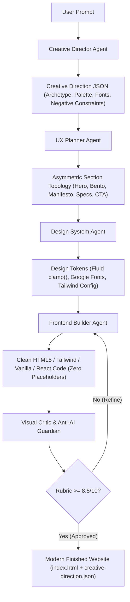
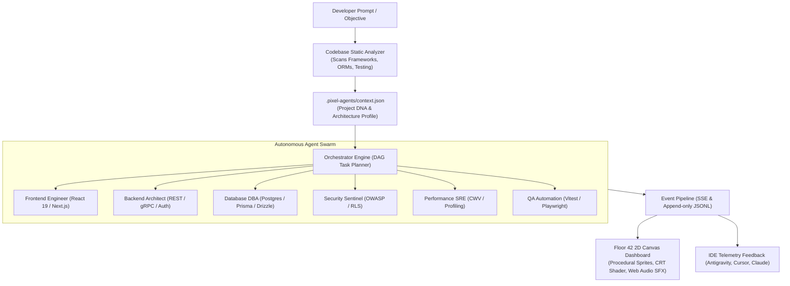

# PixelCrew (`@hiroqt/pixelcrew`)

<p align="center">
  <strong>Local Multi-Agent Orchestration Engine & Retro Pixel-Art Tech Startup Office</strong><br>
  <em>Transform any codebase into an observable, autonomous, and choreographed AI engineering workspace with a single command.</em>
</p>

<p align="center">
  <a href="LICENSE"></a>
  <a href="https://nodejs.org"></a>
  <a href="package.json"></a>
  <a href="https://github.com/hiroqt/PixelCrew"></a>
  <a href="CONTRIBUTING.md"></a>
</p>

```text
┌────────────────────────────────────────────────────────────────────────┐
│  PIXELCREW HQ  ::  FLOOR 42                              ● SWARM LIVE  │
├────────────────────────────────────────────────────────────────────────┤
│                                                                        │
│                    ┌──────────────────────┐                            │
│                    │   LEAD ORCHESTRATOR  │                            │
│                    │        [ ◉ _ ◉ ]     │                            │
│                    │      DAG Dispatch    │                            │
│                    └──────────┬───────────┘                            │
│                               │                                        │
│          ┌────────────────────┼────────────────────┐                   │
│          │                    │                    │                   │
│          ▼                    ▼                    ▼                   │
│    ┌───────────┐        ┌───────────┐        ┌───────────┐             │
│    │ FRONTEND  │        │  BACKEND  │        │ DATABASE  │             │
│    │  [ ◉ ▂ ◉ ]│        │  [ ◉ ▂ ◉ ]│        │  [ ◉ ⊙ ]  │             │
│    │  working  │        │  working  │        │ analyzing │             │
│    └───────────┘        └───────────┘        └───────────┘             │
│          │                    │                    │                   │
│          ▼                    ▼                    ▼                   │
│    ┌───────────┐        ┌───────────┐        ┌───────────┐             │
│    │ CREATIVE  │        │ANTI-AI QA │        │TOKEN SAVER│             │
│    │  [ ★ _ ★ ]│        │  [ 🔍_🔍 ]│        │  [ ◉ ▂ ◉ ]│             │
│    │ Director  │        │Critic >=8.5│       │72% Savings│             │
│    └───────────┘        └───────────┘        └───────────┘             │
│                                                                        │
│  LIVE TELEMETRY STREAM                                                 │
│  ────────────────────────────────────────────────────────────────────  │
│  03:41:02  orchestrator     → decomposed objective into parallel tasks │
│  03:41:03  creativeDirector → formulated asymmetric editorial style    │
│  03:41:04  designSystem     → compiled fluid clamp type & tokens       │
│  03:41:05  visualCritic     → ★ Visual Score: 9.4/10 (Passed >= 8.5)   │
│                                                                        │
│  ACTIVE SKILL ENGINES                                                  │
│  ────────────────────────────────────────────────────────────────────  │
│  ✓ Codebase Intelligence   ✓ Design Director (Anti-AI)  ✓ Token Saver  │
│  ◉ Frontend Engineering    ◉ Database Engineering       ◉ Visual QA    │
│                                                                        │
└────────────────────────────────────────────────────────────────────────┘
```

---

## ⚡ 10-Second Ignition

No global installations or complex configuration required. Run directly in your repository:

```bash
# 1. ✦ OneShot Website Generation (Design-First Multi-Agent Synthesis)
npx pixelcrew oneshot "Build a modern website for a design agency specializing in AI products. Dark, editorial, premium."

# 2. Launch the orchestrator daemon and real-time visual office dashboard
npx pixelcrew start

# 3. Initialize and adapt PixelCrew to an existing codebase
npx pixelcrew init

# 4. Run an instant multi-agent sprint simulation demo
npx pixelcrew demo
```

The interactive dashboard opens automatically at:  
👉 **`http://localhost:4747`** *(auto-recovers to `4748`+ if port 4747 is occupied)*

---

## ✦ OneShot Website Synthesis & Anti-AI Visual Critic

### The Problem: Why Generated Websites Look Generic
Most AI coding tools follow a naive linear prompt pattern:
```
User Prompt  ──>  AI immediately writes React/HTML code  ──>  Generic AI Slop
```
This produces cookie-cutter outputs: purple mesh gradients, repeating 3-column rounded cards, fake floating glassmorphism blobs, and cliché copy like *"Revolutionize your workflow"*.

### The Solution: Decouple Design Direction from Coding
PixelCrew enforces a strict multi-agent creative pipeline before generating code:



### 1. Creative Director Decision Schema
Before writing code, PixelCrew determines:
- **Design Archetype**: *Editorial Asymmetric Grid*, *Technical Lab*, or *Kinetic Studio*.
- **Visual Personality**: High-contrast, intentional whitespace, expressive typography.
- **Negative Constraints**: Strictly bans purple/blue blobs, symmetrical card grids, and placeholder copy.

### 2. 6-Dimension Visual Critic Rubric ($\ge 8.5/10.0$)
Every generated site is scored across a weighted human design rubric:

$$\text{Final Score} = \frac{\text{Originality} + \text{Typography} + \text{Layout} + \text{Visual Hierarchy} + \text{Brand Consistency} + (10 - \text{Generic AI Penalty})}{6}$$

```text
╔═════════════════════════════════════════════════════════════════════╗
║                      PIXEL CREW VISUAL SCORE                        ║
╠═════════════════════════════════════════════════════════════════════╣
║  Originality:           9.1 / 10                                    ║
║  Typography:            9.7 / 10                                    ║
║  Layout & Rhythm:       9.1 / 10                                    ║
║  Visual Hierarchy:      9.4 / 10                                    ║
║  Brand Consistency:     9.3 / 10                                    ║
║  Generic AI Penalty:    -0.4 / 10                                   ║
║                                                                     ║
║  FINAL VISUAL SCORE:    9.4 / 10.0   [✓ APPROVED >= 8.5]            ║
╚═════════════════════════════════════════════════════════════════════╝
```

---

## ⚡ Universal Cross-IDE Token Optimization Engine

PixelCrew includes built-in token optimization rules and metrics across all major AI coding agents:
- **Claude Code**: Prefix prompt cache anchoring ($\ge 1024$ tokens) $\to$ 90% cache read discount.
- **Google Antigravity**: Line-range targeted edits and subagent context encapsulation.
- **Cursor / Kiro / Windsurf**: Compact rule sets ($\le 250$ tokens) and AST symbol extraction over raw files.
- **GitHub Copilot**: Context pruning and structured schema validation.

```text
╔═════════════════════════════════════════════════════════════════════╗
║               CROSS-IDE TOKEN OPTIMIZATION METRICS                  ║
╠═════════════════════════════════════════════════════════════════════╣
║  Raw Estimated Tokens:  42,500 tokens                               ║
║  Actual Tokens Used:    11,800 tokens                               ║
║  Tokens Conserved:      30,700 tokens (72% Savings)                 ║
║  Active Strategy:       AST Skeletons + Pruned Boundaries           ║
╚═════════════════════════════════════════════════════════════════════╝
```

---

## 💡 The Paradigm: Why PixelCrew?

Traditional AI agent tooling runs inside black-box terminal loops: you type a prompt, wait minutes in silence, and hope the agent doesn't hallucinate or clobber your codebase.

**PixelCrew turns the invisible execution loop into an observable, choreographed engineering office.**



### Core Innovations
- **Zero Runtime Dependencies**: Pure Node.js ESM orchestrator with lightweight HTML5/CSS/Canvas. No bloated node_modules. Instant launch.
- **Codebase Context Adaptation**: Auto-discovers frameworks (Next.js, Vite, React, Vue), ORMs (Prisma, Drizzle), and test runners (Vitest, Playwright) to tailor agent permissions and skill injection.
- **Bi-Directional Telemetry**: Accepts event streams over CLI flags, HTTP REST endpoints (`/api/emit`), and append-only `.pixel-agents/events.jsonl` files.
- **Floor 42 Office Engine**: Procedural 2D canvas with CRT scanline simulation, daytime/night-mode cyberpunk lighting, and retro 8-bit Web Audio chimes.

---

## 🧠 The 8 Engineering Skill Pillars

PixelCrew equips agents with production-grade engineering skill modules located under `.agents/skills/` (and mirrored to `.pixel-agents/skills/`):

### 1. `design-director`
Lead creative direction and authentic visual personality engine. Decouples artistic strategy, typographic clamp scales, and negative constraints before frontend code generation.

### 2. `anti-ai-patterns`
Strict Anti-AI-Generated Design Critic and Quality Guardian. Automatically detects purple mesh gradients, repeating 3-card grids, and cliché copy, enforcing intentional asymmetry and brand-specific visual language.

### 3. `token-efficiency`
Universal token optimization and context conservation engine across Claude, Google Antigravity, Cursor, Kiro, Windsurf, and Copilot. Slashes token usage by 50% to 75% through AST symbol extraction, prompt caching, and boundary pruning.

### 4. `codebase-intelligence`
Static analysis and project adaptation. Automatically inspects repository dependencies, directory structures, ORMs, API routes, and testing runners to ground every subagent in current architectural patterns.

### 5. `frontend-engineering`
Modern frontend architecture across React 19, Next.js App Router, Vue 3, Svelte 5, and vanilla CSS. Enforces strict anti-slop design rules, fluid `clamp()` typography, semantic HTML, and WCAG AA accessibility compliance.

### 6. `backend-engineering`
Enterprise backend standards: Clean Architecture, Hexagonal / Ports & Adapters, OpenAPI 3.1, RFC 7807 error envelopes, sliding-window rate limiting, idempotency key middleware, and OAuth 2.1 / PASETO security.

### 7. `database-engineering`
Advanced query tuning and indexing: B-Tree, GIN, GiST, BRIN, composite indexing column order, EXPLAIN ANALYZE interpretation, UUIDv7 vs ULID primary keys, Row-Level Security (RLS) isolation, and connection pooling.

### 8. `performance-engineering`
Full-stack profiling: Core Web Vitals (LCP, INP, CLS), main-thread yielding, streaming SSR, multi-tier caching (L1 in-memory, L2 Redis, L3 CDN), database connection pool sizing, and automated k6 stress testing.

---

## 🛠️ Cross-Harness Installation & IDE Setup

PixelCrew integrates seamlessly with all leading AI coding assistants and agent environments:

### Google Antigravity IDE (Recommended)
Register PixelCrew globally so Antigravity agents automatically stream to your visual office:

```bash
# Register global plugin
mkdir -p ~/.gemini/config/plugins/pixel-agents/skills/pixel-agents
cp plugins/plugin.json ~/.gemini/config/plugins/pixel-agents/
cp .agents/skills/pixel-agents/SKILL.md ~/.gemini/config/plugins/pixel-agents/skills/pixel-agents/
```

Whenever you prompt inside Antigravity:
> *"Synthesize a modern website for an AI architecture lab using PixelCrew"*

The agent automatically loads the skill, executes the task, and streams live sprite animations and status logs to your browser.

---

### Claude Code
Install project-locally or link globally:

```bash
# Project-local install
mkdir -p .claude/skills/pixel-agents
cp .agents/skills/pixel-agents/SKILL.md .claude/skills/pixel-agents/
```

---

### Cursor IDE
Add to your project's agent rules or skills:

```bash
mkdir -p .cursor/skills/pixel-agents
cp .agents/skills/pixel-agents/SKILL.md .cursor/skills/pixel-agents/
```

*Ensure Agent Skills are enabled under Cursor Settings → Beta.*

---

### OpenAI Codex CLI
Install project-locally with native hook support:

```bash
mkdir -p .agents/skills
cp -r .agents/skills/* .agents/skills/
```

---

### GitHub Copilot / Grok Build / Gemini CLI / Trae / OpenCode
Copy the `.agents/skills/` directory into your tool's native skills folder:
- **GitHub Copilot**: `.github/skills/pixel-agents/`
- **Gemini CLI**: `~/.gemini/config/skills/pixel-agents/`
- **Grok Build**: `.grok/skills/pixel-agents/`
- **Trae**: `~/.trae/skills/` or `~/.trae-cn/skills/`

---

## 💻 CLI Terminal Reference

| Command | Action | Example |
| :--- | :--- | :--- |
| `npx pixelcrew oneshot "<prompt>"` | **Synthesizes modern website with Visual Critic loop** | `npx pixelcrew oneshot "Dark editorial AI studio"` |
| `npx pixelcrew start` | Launches orchestrator, SSE stream, and web dashboard | `npx pixelcrew start --port 4747` |
| `npx pixelcrew init` | Scaffolds `.pixel-agents/` and adapts to repository | `npx pixelcrew init --yes` |
| `npx pixelcrew analyze` | Prints detected frameworks, database, ORM, and test stack | `npx pixelcrew analyze` |
| `npx pixelcrew demo` | Launches an interactive multi-agent simulated sprint | `npx pixelcrew demo` |
| `npx pixelcrew task "<text>"` | Dispatches a direct objective to the running agent swarm | `npx pixelcrew task "Optimize SQL queries"` |
| `npx pixelcrew emit [flags]` | Emits a custom telemetry event into the stream | `npx pixelcrew emit --agent db --message "Done"` |
| `npx pixelcrew dashboard` | Opens or serves the standalone Floor 42 dashboard UI | `npx pixelcrew dashboard` |
| `npx pixelcrew status` | Prints ASCII summary of swarm states and active sprints | `npx pixelcrew status` |
| `npx pixelcrew help` | Displays full CLI manual and flag details | `npx pixelcrew help` |

### CLI Options & Flags:
- `--target <framework>`: Target framework for OneShot (`vanilla`, `nextjs`)
- `--out <dir>`: Custom destination directory for generated site (default: `./generated-site`)
- `--port <number>`: Dashboard port (default: `4747`)
- `--no-open`: Prevents auto-launching browser on startup
- `--yes`, `-y`: Bypasses interactive prompts during initialization
- `--agent <name>`: Target agent for event emission (`frontend`, `backend`, `database`, `security`, `performance`, `qa`, `creativeDirector`, `uxPlanner`, `designSystem`, `visualCritic`)
- `--type <type>`: Event category (`spawn`, `thinking`, `tool`, `skill`, `complete`, `error`)
- `--message <text>`: Description payload for the event log
- `--skill <name>`: Skill tag associated with the action

---

## 🎮 Dashboard Controls & Keybindings

| Key / Control | Function | Description |
| :--- | :--- | :--- |
| `[O]` | **OneShot Studio** | Opens the interactive OneShot Multi-Agent Synthesis studio |
| `[R]` | **Audit Reports** | Toggles the comprehensive multi-agent audit reports drawer |
| `[SPACE]` | **Launch Demo** | Boots the swarm and runs a simulated multi-agent sprint |
| `[1] - [6]` | **Agent Inspector** | Opens the dedicated status drawer and permissions for agents 1 through 6 |
| `[ESC]` | **Close Modals** | Closes any active OneShot studio, reports drawer, or inspector modal |
| `CRT Button` | **Scanline Shader** | Toggles retro arcade phosphor scanlines and vignette effect |
| `NIGHT Button` | **Cyberpunk Shift** | Switches between warm day office and neon cyberpunk night lighting |
| `SFX Button` | **Web Audio Synth** | Toggles procedural 8-bit chip-tune feedback sounds |essage "Done"` |
| `npx pixelcrew dashboard` | Opens or serves the standalone Floor 42 dashboard UI | `npx pixelcrew dashboard` |
| `npx pixelcrew status` | Prints ASCII summary of swarm states and active sprints | `npx pixelcrew status` |
| `npx pixelcrew help` | Displays full CLI manual and flag details | `npx pixelcrew help` |

### CLI Options & Flags:
- `--port <number>`: Dashboard port (default: `4747`)
- `--no-open`: Prevents auto-launching browser on startup
- `--yes`, `-y`: Bypasses interactive prompts during initialization
- `--agent <name>`: Target agent for event emission (`frontend`, `backend`, `database`, `security`, `performance`, `qa`)
- `--type <type>`: Event category (`spawn`, `thinking`, `tool`, `skill`, `complete`, `error`)
- `--message <text>`: Description payload for the event log
- `--skill <name>`: Skill tag associated with the action

---

## 📂 Workspace Manifest & Architecture

Initializing PixelCrew creates a self-contained `.pixel-agents/` control directory in your repository:

```
your-project/
├── .pixel-agents/
│   ├── config.json              # Swarm concurrency, agent permissions, and dashboard settings
│   ├── context.json             # Cached static analysis of frameworks, ORMs, and paths
│   ├── state.json               # Real-time state of every agent persona
│   ├── events.jsonl             # Append-only persistent telemetry event log
│   ├── agents/                  # Specialized agent persona definitions
│   └── skills/                  # Grounded engineering skill markdown manuals
├── .pixel-dashboard/            # Zero-dependency HTML5 canvas visual office bundle
├── DESIGN.md                    # Visual tokens, canvas coordinate engine & audio specs
├── PRODUCT.md                   # Product vision, technical roadmap, and architectural goals
└── README.md
```

---

## 🎮 Dashboard Controls & Keybindings

| Key / Control | Function | Description |
| :--- | :--- | :--- |
| `[O]` | **OneShot Studio** | Opens the interactive OneShot Multi-Agent Synthesis studio |
| `[R]` | **Audit Reports** | Toggles the comprehensive multi-agent audit reports drawer |
| `[SPACE]` | **Launch Demo** | Boots the swarm and runs a simulated multi-agent sprint |
| `[1] - [6]` | **Agent Inspector** | Opens the dedicated status drawer and permissions for agents 1 through 6 |
| `[ESC]` | **Close Modals** | Closes any active OneShot studio, reports drawer, or inspector modal |
| `CRT Button` | **Scanline Shader** | Toggles retro arcade phosphor scanlines and vignette effect |
| `NIGHT Button` | **Cyberpunk Shift** | Switches between warm day office and neon cyberpunk night lighting |
| `SFX Button` | **Web Audio Synth** | Toggles procedural 8-bit chip-tune feedback sounds |

---

## 🧪 Development & Testing

Run unit tests across the orchestrator engine, scaffolders, and server endpoints:

```bash
# Clone the repository
git clone https://github.com/hiroqt/PixelCrew.git
cd PixelCrew

# Run the zero-dependency test suite
npm test
```

---

## 📚 Documentation & Specifications

- [📐 DESIGN.md](DESIGN.md) — 2D Canvas coordinate matrix, sprite frame animations, color tokens, and Web Audio oscillator formulas.
- [🎯 PRODUCT.md](PRODUCT.md) — Product vision, target personas, problem analysis, and development roadmap (v0.1 to v0.5).
- [🤝 CONTRIBUTING.md](CONTRIBUTING.md) — How to author new skills, add custom agent sprites, and submit pull requests.
- [⚖️ LICENSE](LICENSE) — Apache 2.0 open-source license.

---

## 🌟 Community & Contributing

Contributions of all types are warmly welcomed!

- **Create New Skills**: Add new technology guides to `.pixel-agents/skills/` (e.g. GraphQL, Supabase, Redis, Rust, Astro).
- **Design Office Packs**: Add custom pixel-art furniture, workstations, and seasonal office themes.
- **Improve Orchestration**: Enhance DAG task scheduling, automated error recovery, and concurrency management.
- **Report Bugs**: Submit issues and feature proposals at [github.com/hiroqt/PixelCrew/issues](https://github.com/hiroqt/PixelCrew/issues).

---

## 📄 License

PixelCrew is open-source software licensed under the **[Apache License, Version 2.0](LICENSE)**.

---

<p align="center">
  Crafted with precision by <strong>Arnel</strong> (<a href="https://github.com/hiroqt">@hiroqt</a>).
</p>
