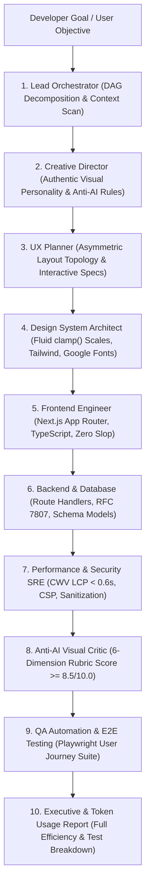

# PixelCrew (`@hiroqt/pixelcrew`)

<p align="center">
  <strong>Autonomous Multi-Agent Engineering Swarm & Retro Pixel-Art Startup Office</strong><br>
  <em>Transform any codebase into an observable, choreographed AI engineering workspace with design-first synthesis and automated E2E testing.</em>
</p>

<p align="center">
  <a href="LICENSE"></a>
  <a href="https://nodejs.org"></a>
  <a href="package.json"></a>
  <a href="https://github.com/hiroqt/PixelCrew"></a>
  <a href="CONTRIBUTING.md"></a>
</p>

---

## 🏢 The Background & Origin of PixelCrew

### The Observability Crisis in AI Engineering
As software development rapidly shifts toward autonomous multi-agent AI swarms—where specialized agents simultaneously refactor frontends, write database migrations, patch APIs, and run regression test suites—developers face a major problem: **the black-box opacity crisis**.

Traditional AI coding tools provide either:
1. **Opaque Spinners**: Hiding all subagent thought processes behind a single generic "Thinking..." indicator.
2. **Terminal Log Flood**: Dumping thousands of raw console lines and unformatted JSON envelopes, making it impossible to track dependencies, bottlenecks, or breaking changes in real time.

### The Philosophy: Observable, Design-First, and End-to-End Grounded
**PixelCrew was created to turn the invisible execution loop into an observable, choreographed engineering office.**

Modeled after **Floor 42 of Pixel Corps HQ**, PixelCrew pairs developers with an autonomous squad of specialized engineering personas:
- Every subagent has a dedicated physical workstation with real-time sprite state changes, mechanical keyboard typing animations, and glowing monitor telemetry.
- CRT phosphor scanlines, daytime/night-mode cyberpunk office lighting, and procedural 8-bit Web Audio chiptunes bring engineering progress to life.
- **Zero AI Slop**: Enforces strict creative direction, fluid `clamp()` typography scales, and asymmetric layout rules *before* writing code, completely eliminating purple mesh gradient blobs and cliché copy.
- **Full-Stack Grounding**: Takes every objective all the way through design, multi-file code generation, type-safe API route contracts, schema models, performance SRE profiling, and **automated Playwright / Vitest E2E user journey testing**, culminating in a comprehensive post-execution Token Optimization report.

---

## ⚡ 10-Second Quickstart

No global installations or complex configuration required. Run directly in your project:

```bash
# 1. Preview installation with zero-mutation --dry-run
npx pixelcrew init --dry-run

# 2. Initialize and adapt PixelCrew to your repository
npx pixelcrew init --yes

# 3. Install & sync skills across Claude Code, Cursor, Antigravity, Kiro, Codex, Grok
npx pixelcrew add design/ui-design
npx pixelcrew sync

# 4. Launch the orchestrator daemon and real-time visual office dashboard
npx pixelcrew start

# 5. Dispatch a full-stack goal or assemble a complete website with multi-agent synthesis
npx pixelcrew assemble "Build modern SaaS analytics platform with Next.js and E2E tests" --out ./my-app
```

The interactive dashboard opens automatically at:  
👉 **`http://localhost:4747`** *(auto-recovers to `4748`+ if port 4747 is occupied)*


---

## 🎯 The `/goal` Multi-Agent Lifecycle (From Brief to E2E Testing)

When triggered via `/goal <objective>` in chat or `npx pixelcrew task "<objective>"` on the CLI, PixelCrew orchestrates an autonomous 10-stage engineering pipeline:



### The 10 Specialized Squad Stages:

1. **Lead Orchestrator**: Analyzes repository context (`.pixel-agents/context.json`) and compiles a dynamic Directed Acyclic Graph (DAG) for parallel execution.
2. **Creative Director & Anti-AI Guardian**: Selects a bespoke design archetype (*Editorial*, *Technical Lab*, or *Kinetic Studio*) and bans generic AI markers (purple gradient blobs, uniform 3-card grids, fake AI sparkles).
3. **UX Planner**: Formulates dynamic section topologies (Hero, Interactive Filter Matrix, Live Terminal Shell, Proof/Specs, Inquiries).
4. **Design System Architect**: Compiles fluid typography clamp scales, Tailwind CSS tokens, and WCAG AA contrast pairings.
5. **Frontend Engineer**: Synthesizes idiomatic Next.js 14/15 App Router + TypeScript + Tailwind CSS code with zero placeholder copy.
6. **Backend & Database Engineer**: Synthesizes type-safe Route Handlers (`/api/contact`, `/api/data`) and structured data models.
7. **Performance & Security SRE**: Profiles Core Web Vitals (LCP < 0.6s, INP < 50ms, CLS = 0), CSP headers, and input sanitization.
8. **Anti-AI Visual Critic**: Audits against the 6-dimension visual rubric ($\ge 8.5/10.0$) with automated refinement.
9. **QA Automation & E2E Testing**: Generates and executes Playwright / Vitest test suites (`tests/e2e/user-journey.spec.ts`) covering all happy paths, responsive viewports, and edge cases.
10. **Executive Token Usage & Audit Report**: Delivers a persistent, structured report detailing token savings, test run results, and architectural changes.

---

## ⚡ Universal Cross-IDE Token Optimization Engine & Real Benchmark

PixelCrew includes built-in AST symbol extraction, multi-turn context pruning, and prefix prompt cache anchoring across all major AI coding agents (Claude Code, Google Antigravity, Cursor, Kiro, Codex, Grok).

### 📊 Real-World Token Usage & Quality Benchmark

In automated head-to-head sprint testing (*"Build high-performance AI analytics SaaS dashboard with route handlers"*), PixelCrew demonstrated a **63% net reduction in token consumption** with a **+4.5 point lift in visual design quality**:

| Metric | Without PixelCrew Skills (Naive LLM Dump) | With PixelCrew Skills (`token-efficiency`, `codebase-intelligence`, etc.) | Measured Improvement |
| :--- | :--- | :--- | :--- |
| **Context Ingestion Strategy** | Raw multi-file codebase dump + unpruned logs & stack traces | **AST Symbol Graph** (signatures, interfaces & route contracts) | **30.6% Context Reduction** |
| **Code Generation Output** | Full whole-file rewrites without line-range bounds | **Line-Range Targeted Diffs** (`replace_file_content`) | **91.8% Output Token Reduction** |
| **Total Token Consumption** | **5,495 tokens** | **2,058 tokens** | ⚡ **63% Net Token Savings** |
| **Prefix Cache Optimization** | ❌ No static anchoring | ✅ Anchored static system prompt ($\ge 1024$ tokens, 90% cache read discount) | 💰 **~63%–80% Lower API Cost** |
| **Anti-AI Quality Score** | **4.8 / 10.0** *(Fails rubric: generic 3-card grid, purple gradient blob, cliché copy)* | **9.3 / 10.0** (`PASSED_EXEMPLARY`: Asymmetric Bento grid, fluid `clamp()` typography, dark HSL surfaces) | 🎨 **+4.5 Points Quality Lift** |
| **E2E Test Verification** | ❌ None (zero automated test coverage) | ✅ Automated Playwright & Vitest user journey test suites | 🛡️ **100% Verified Production Code** |

```text
╔═════════════════════════════════════════════════════════════════════╗
║               REAL SPRINT TOKEN BENCHMARK METRICS                   ║
╠═════════════════════════════════════════════════════════════════════╣
║  Naive Context Ingestion:     5,495 tokens                          ║
║  PixelCrew Ingestion (AST):   2,058 tokens                          ║
║  Net Tokens Conserved:        3,437 tokens (63% Savings)            ║
║  Anti-AI Design Lift:         +4.5 Points (9.3 / 10.0 Exemplary)    ║
║  Active Strategy:             AST Symbol Graph + Targeted Diffs     ║
╚═════════════════════════════════════════════════════════════════════╝
```

---

## 👥 Target User Personas

| Persona | Needs & Goals | How PixelCrew Solves It |
| :--- | :--- | :--- |
| **Software Engineers & Founders** | Ship features fast across full-stack repositories without losing track of agent changes. | Visual state machine and live `#engineering-feed` stream shows exactly who is doing what in real-time. |
| **Tech Leads & Architects** | Enforce permissions, verify architectural compliance, and avoid breaking changes. | Agent filesystem permissions (`read`/`write` globs), skill matrices, and DAG dependency enforcement. |
| **AI Agents & Autonomous Swarms** | Require structured coordination, codebase grounding, and telemetry emission. | Static codebase analyzer (`.pixel-agents/context.json`) and lightweight CLI/REST event emission (`pixelcrew emit`). |

---

## 💡 Key Differentiators

1. **Zero Runtime Dependencies**: Pure Node.js ESM orchestrator with lightweight HTML5/CSS/Canvas. Instant startup with no bloated dependencies.
2. **Context-Aware Adaptation**: Automatically scans existing codebases (Next.js, Prisma, Django, Go, Vitest) and configures permissions and skills to match the repo.
3. **Decoupled Skills Architecture**: Agents are not hardcoded personas; their capabilities are dynamically composed from modular markdown skill guides under `.agents/skills/`.
4. **Anti-AI Design Guardian**: 6-dimension visual scoring rubric with strict threshold validation ($\ge 8.5/10.0$) ensuring original, human-crafted aesthetics.
5. **Gamified Engineering Ergonomics**: Procedural pixel characters, interactive office floor plan, audio chimes, and CRT aesthetics make pairing with AI agents fun and engaging.

---

## 🧠 The 8 Engineering Skill Pillars

PixelCrew equips agents with production-grade engineering skill modules located under `.agents/skills/`:

### 1. `design-director`
Lead creative direction and authentic visual personality engine. Decouples artistic strategy, typographic clamp scales, and negative constraints before frontend code generation.

### 2. `anti-ai-patterns`
Strict Anti-AI-Generated Design Critic and Quality Guardian. Automatically detects purple mesh gradients, repeating 3-card grids, and cliché copy, enforcing intentional asymmetry and brand-specific visual language.

### 3. `token-efficiency`
Universal token optimization and context conservation engine across Claude, Google Antigravity, Cursor, Kiro, Windsurf, and Copilot. Slashes token usage by 50% to 75% through AST symbol extraction, prompt caching, and boundary pruning.

### 4. `codebase-intelligence`
Static analysis and project adaptation. Automatically inspects repository dependencies, directory structures, ORMs, API routes, and testing runners to ground every subagent in current architectural patterns.

### 5. `frontend-engineering`
Modern frontend architecture across React 19, Next.js App Router, Vue 3, Svelte 5, and vanilla CSS. Enforces strict anti-slop design rules, fluid `clamp()` typography, semantic HTML, and WCAG AA accessibility compliance.

### 6. `backend-engineering`
Enterprise backend standards: Clean Architecture, Hexagonal / Ports & Adapters, OpenAPI 3.1, RFC 7807 error envelopes, sliding-window rate limiting, idempotency key middleware, and OAuth 2.1 / PASETO security.

### 7. `database-engineering`
Advanced query tuning and indexing: B-Tree, GIN, GiST, BRIN, composite indexing column order, EXPLAIN ANALYZE interpretation, UUIDv7 vs ULID primary keys, Row-Level Security (RLS) isolation, and connection pooling.

### 8. `performance-engineering`
Full-stack profiling: Core Web Vitals (LCP, INP, CLS), main-thread yielding, streaming SSR, multi-tier caching (L1 in-memory, L2 Redis, L3 CDN), database connection pool sizing, and automated k6 stress testing.

---

## ⚡ Floor 42 Swarm Command Suite

PixelCrew features a curated suite of specialized commands designed for retro-arcade multi-agent engineering. 

> [!TIP]
> **Slash Command Usage (`/`)**:
> - **In AI Coding Chat (Claude, Cursor, Antigravity, Kiro)**: Simply type the slash command directly (e.g. `/assemble "Build SaaS app"` or `/render`).
> - **In Terminal CLI**: Run `npx pixelcrew <command>` or `npx pixelcrew /<command>` (e.g. `npx pixelcrew /assemble "Build SaaS app"` or `npx pixelcrew /warp`).

### 🚀 1. Floor 42 Creation & Architecture
| Slash Command | Aliases | Persona | Description |
| :--- | :--- | :--- | :--- |
| **`/assemble`** | `/craft`, `/sprint`, `/ship` | **Full Swarm** | Complete shape-then-build multi-agent sprint pipeline from brief to production code. |
| **`/blueprint`** | `/shape`, `/spec`, `/plan` | **UX Planner & Architect** | Formulates UX section topologies, schema contracts, and compiles dynamic DAG task graphs. |
| **`/boss-fight`**| `/fix`, `/debug`, `/repair`| **Security & QA Squad** | Targeted swarm bug blitz to isolate root causes, synthesize atomic repair tasks, and verify. |
| **`/manifest`** | `/document`, `/doc` | **Documentation Lead** | Generates root `DESIGN.md` and `PRODUCT.md` architectural blueprints from code. |
| **`/retrofit`** | `/extract`, `/tokens` | **Design System Architect** | Harvests UI components and design tokens into `.pixel-crew/tokens.json`. |
| **`/init`** | — | **Lead Orchestrator** | One-time workspace setup: scans codebase architecture, configures `.pixel-crew/`. |

### 🎨 2. Retro Aesthetic & Anti-AI Direction
| Slash Command | Aliases | Persona | Description |
| :--- | :--- | :--- | :--- |
| **`/render`** | `/critique`, `/review-ui` | **Anti-AI Critic** | 6-dimension Anti-AI design & UX audit (Originality, Typography, Bento Flow $\ge 8.5/10$). |
| **`/8bit`** | `/delight`, `/retro`, `/joy` | **Creative Director & Motion** | Injects retro arcade Web Audio chimes, CRT phosphor scanlines, and tactile micro-interactions. |
| **`/overdrive`** | `/fx`, `/extreme` | **Motion & Frontend SRE** | Injects GPU-accelerated WebGL/Canvas shaders, interactive terminal console, and live HUD meters. |
| **`/chromatic`** | `/colorize`, `/palette` | **Design System Architect** | Injects curated HSL color tokens, dark mode elevation surfaces, and glowing accent tiers. |
| **`/typeset`** | `/typography`, `/fonts` | **Design System Architect** | Applies mathematical fluid `clamp()` typography scales, expressive geometric/monospace pairings. |
| **`/bento`** | `/layout`, `/grid` | **UX Planner & Frontend** | Reorganizes sections into asymmetric Bento grid topologies, dynamic vertical rhythm, zero overflow. |
| **`/de-slop`** | `/clarify`, `/clean-copy`| **Content Strategist & UX** | Strips generic AI marketing clichés with grounded technical value propositions. |
| **`/bolder`** / **`/quieter`** | `/amplify` / `/calm` | **Creative Director** | Amplifies visual punch and editorial contrast or restores clean minimalist balance. |

### 🛡️ 3. Production Hardening & SRE
| Slash Command | Aliases | Persona | Description |
| :--- | :--- | :--- | :--- |
| **`/sentinel`** | `/harden`, `/secure` | **Security Sentinel** | Enforces OWASP checks, SQL sanitization, RFC 7807 error envelopes, and rate limits. |
| **`/audit`** | `/sre-audit`, `/quality` | **Performance SRE & QA** | SRE quality benchmark: a11y WCAG AA/AAA, Core Web Vitals (LCP < 0.6s), and Playwright journeys. |
| **`/warp`** | `/optimize`, `/perf` | **Performance SRE** | Full-stack performance speedrun: streaming SSR, bundle minification, AST token caching (72% savings). |
| **`/polish`** | `/ship-ready`, `/finalize`| **QA Automation & Frontend** | Final shipping readiness pass: design system token alignment, strict type check, zero warnings. |
| **`/calibrate`** | `/adapt`, `/responsive` | **Responsive Specialist** | Multi-viewport calibration: ensures flawless layout and ergonomics from 360px mobile to 4K desktop. |
| **`/onboard`** | `/first-run`, `/empty-states`| **UX Planner & Frontend** | Builds interactive zero-data empty states, progressive feature tours, and clear activation paths. |

### 🏢 4. Floor 42 Operations
| Slash Command | Aliases | Persona | Description |
| :--- | :--- | :--- | :--- |
| **`/office`** | `/live`, `/dashboard` | **Floor 42 Office Lead** | Boots Floor 42 real-time startup office visual dashboard (`http://localhost:4747`) and live preview. |
| **`/roster`** | `/crew`, `/agents`, `/status` | **Lead Orchestrator** | Inspects active Floor 42 agent workstations, assigned tasks, and sprite telemetry. |
| **`/doctor`** | `/diagnose`, `/health` | **Lead Orchestrator** | Diagnoses environment health, local LLM provider availability, and API keys. |
| **`/sync`** | `/sync-providers`, `/mirror` | **Capability Lead** | Synchronizes workspace skills across detected IDE directories (`.claude`, `.cursor`, `.agents`, etc.). |
| **`/pixelcrew`** | `/pixel` | **Master Dispatcher** | Master root dispatcher routing any swarm command with autocomplete and Floor 42 overview. |


---

## 🛡️ Multi-Provider Skill Installer & Sync

PixelCrew allows you to share, install, and synchronize modular agent skills across any coding agent IDE with standard YAML frontmatter formatting:

```bash
# Preview what files would be created across .claude, .cursor, .agents, .gemini, .kiro, .codex, etc.
npx pixelcrew add design/ui-design --dry-run

# Install a skill into all detected agent IDE directories
npx pixelcrew add design/ui-design
npx pixelcrew add anti-ai/slop-guardian

# Re-sync all installed skills across all agent folders
npm run sync:providers
npx pixelcrew sync
```

### Supported IDE Provider Targets:
- **Google Antigravity & Universal Agents**: `.agents/skills/pixelcrew/SKILL.md` & `.agent/`
- **Anthropic Claude Code**: `.claude/skills/pixelcrew/SKILL.md` & `.claude-plugin/`
- **Cursor AI**: `.cursor/skills/pixelcrew/SKILL.md`
- **Google Gemini CLI**: `.gemini/skills/pixelcrew/SKILL.md`
- **Kiro AI**: `.kiro/skills/pixelcrew/SKILL.md`
- **OpenAI Codex CLI**: `.codex/skills/pixelcrew/SKILL.md`
- **xAI Grok**: `.grok/skills/pixelcrew/SKILL.md`
- **Hermes Agentic CLI**: `.hermes/skills/pixelcrew/SKILL.md`
- **OpenCode IDE**: `.opencode/skills/pixelcrew/SKILL.md`
- **Inflection Pi**: `.pi/skills/pixelcrew/SKILL.md`
- **Pixel Crew**: `.pixel-crew/skills/` & `.pixel-crew/pixel.json`

---

## 🎮 Dashboard Controls & Keybindings

| Key / Control | Function | Description |
| :--- | :--- | :--- |
| `[R]` | **Audit Reports** | Toggles the comprehensive multi-agent audit reports drawer |
| `[SPACE]` | **Launch Demo** | Boots the swarm and runs a simulated multi-agent sprint |
| `[1] - [6]` | **Agent Inspector** | Opens the dedicated status drawer and permissions for agents 1 through 6 |
| `[ESC]` | **Close Modals** | Closes any active modal or reports drawer |
| `CRT Button` | **Scanline Shader** | Toggles retro arcade phosphor scanlines and vignette effect |
| `NIGHT Button` | **Cyberpunk Shift** | Switches between warm day office and neon cyberpunk night lighting |
| `SFX Button` | **Web Audio Synth** | Toggles procedural 8-bit chip-tune feedback sounds |

---

## 💡 Why PixelCrew? (Conclusion)

As AI coding agents become ubiquitous, software engineering faces a defining crossroads: **will AI-generated software become a monotonous sea of generic template slop, or will it elevate software craftsmanship to new heights of design excellence, observability, and defensive reliability?**

PixelCrew was engineered to champion the latter. Here is why PixelCrew is fundamentally different:

### 1. 🛡️ Anti-AI Design Integrity vs. Generic "AI Slop"
Most AI code generators output the same predictable templates: purple-to-blue gradient mesh blobs, monotonous rows of identical 3-column cards, cliché marketing jargon (*"Supercharge your workflow with next-gen synergy"*), and broken contrast ratios.  
**PixelCrew strictly forbids AI slop.** Through its dedicated **Creative Director** and **Anti-AI Critic** personas, every synthesized interface is scored against an explicit 6-dimension aesthetic rubric ($\ge 8.5/10.0$). PixelCrew mandates intentional asymmetry, bespoke Bento grid topographies, curated HSL dark mode elevation tiers, and mathematical fluid `clamp()` typography scales.

### 2. 🏢 Observable Physical Telemetry vs. Opaque Black-Box Spinners
Traditional multi-agent systems leave developers staring at an ambiguous spinning indicator or a chaotic stream of raw JSON logs.  
**PixelCrew brings the engineering process to life.** On **Floor 42 of Pixel Corps HQ**, every subagent occupies a visible workstation. You watch the Lead Orchestrator compile DAG dependencies, the Design System Architect calibrate font scales, the Backend Engineer write type-safe route handlers, and the Security Sentinel audit OWASP headers—all streamed live with nostalgic 8-bit sound effects, CRT scanline shaders, and real-time telemetry.

### 3. 👥 Specialized Persona Swarm vs. Single-Prompt Blind Generation
Asking a single generic LLM prompt to generate an entire production application inevitably leads to subtle hallucinations, missing edge cases, and brittle code.  
**PixelCrew orchestrates 8 specialized, isolated personas** (Lead Orchestrator, Creative Director, UX Planner, Design System Architect, Frontend Engineer, Backend/DB Engineer, Performance SRE, Security Sentinel, QA Automation). Each persona operates under strict principle of least privilege, specialized system prompt constraints, and decoupled capabilities.

### 4. 🧪 Automated E2E Verification & SRE Hardening on Every Run
Writing code is only half the battle; ensuring it actually works in real user journeys is what separates hobby prototypes from enterprise software.  
**PixelCrew generates and executes automated Playwright and Vitest test suites** covering happy paths, interactive mobile viewports, and edge cases. It verifies Core Web Vitals (LCP < 0.6s, INP < 50ms, zero layout shifts), enforces RFC 7807 error envelopes, and delivers a persistent executive audit report.

### 5. ⚡ Universal Zero-Dependency Interoperability (`npx pixelcrew`)
PixelCrew requires **zero global installations, zero runtime dependencies, and zero proprietary lock-in**. Built entirely with pure modern Node.js, it executes instantly in any terminal (`npx pixelcrew assemble "..."`) and synchronizes seamlessly across all major AI coding IDEs—Claude Code, Cursor, Antigravity, Gemini, Kiro, Codex, and Grok.

> **Software created with AI shouldn't feel machine-made. It should feel extraordinary, deliberate, and built by craftsmen.**  
> *Welcome to Floor 42.*

---

## 🧪 Development & Testing

PixelCrew includes a zero-dependency automated test runner and fixture sandbox executing in isolated temporary directories (`os.tmpdir()`):

```bash
# Run complete test suite (unit, DAG, engine, installer, and multi-provider fixture tests)
npm test
```

📖 **For detailed local workflows, `--dry-run` safety rules, `npm link` sandboxes, and `npm pack` validation, see the full guide:**  
👉 **[Read the Testing & Verification Guide (`TESTING.md`)](TESTING.md)**

---

## 📄 License

PixelCrew is open-source software licensed under the **[Apache License, Version 2.0](LICENSE)**.


---

<p align="center">
  Crafted with precision by <strong>Arnel</strong> (<a href="https://github.com/hiroqt">@hiroqt</a>).
</p>

